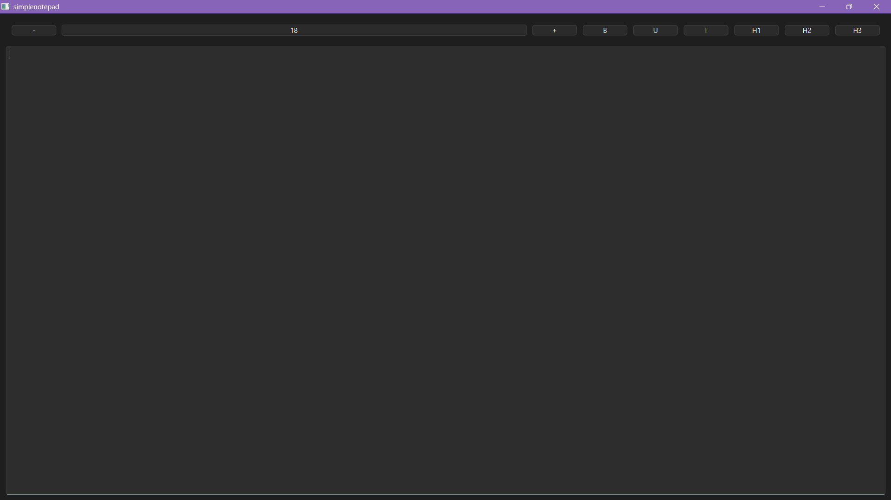
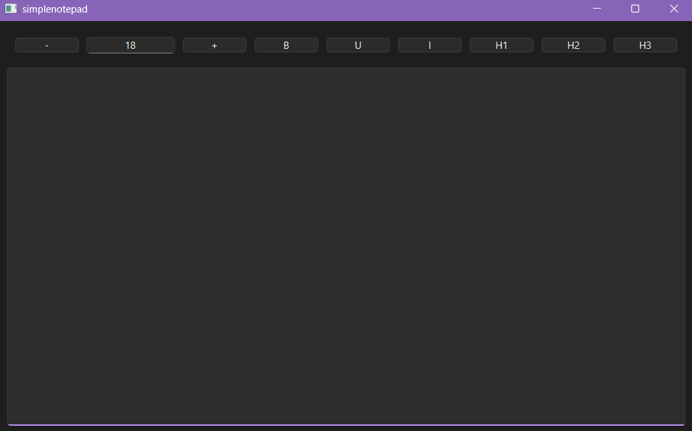
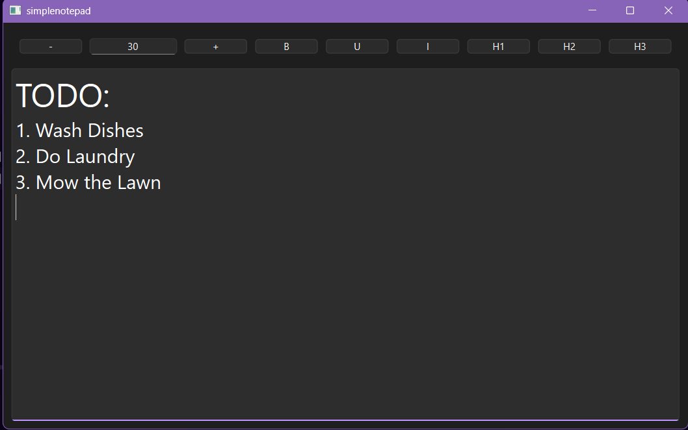
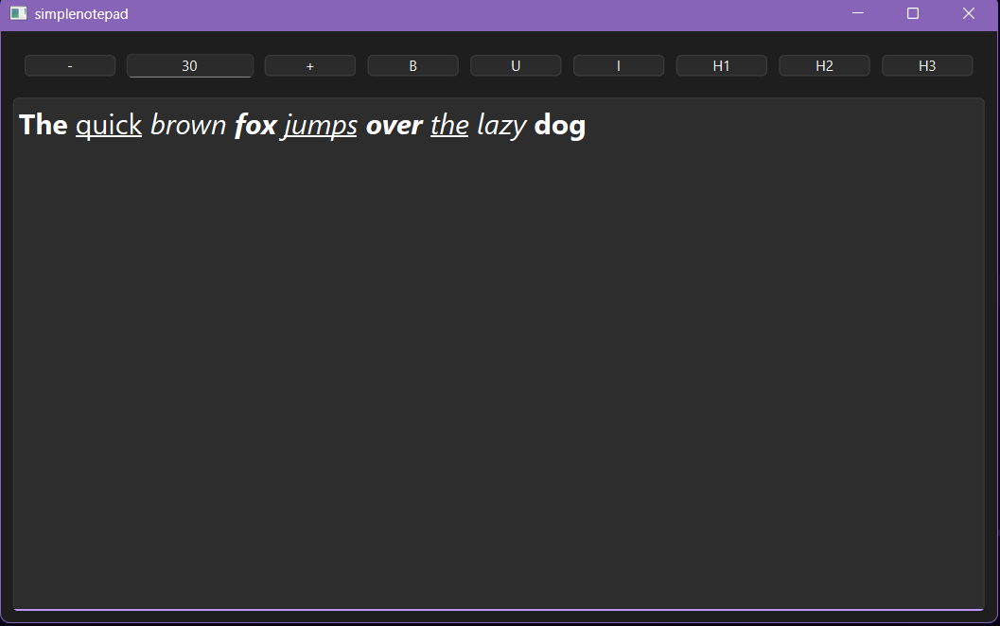
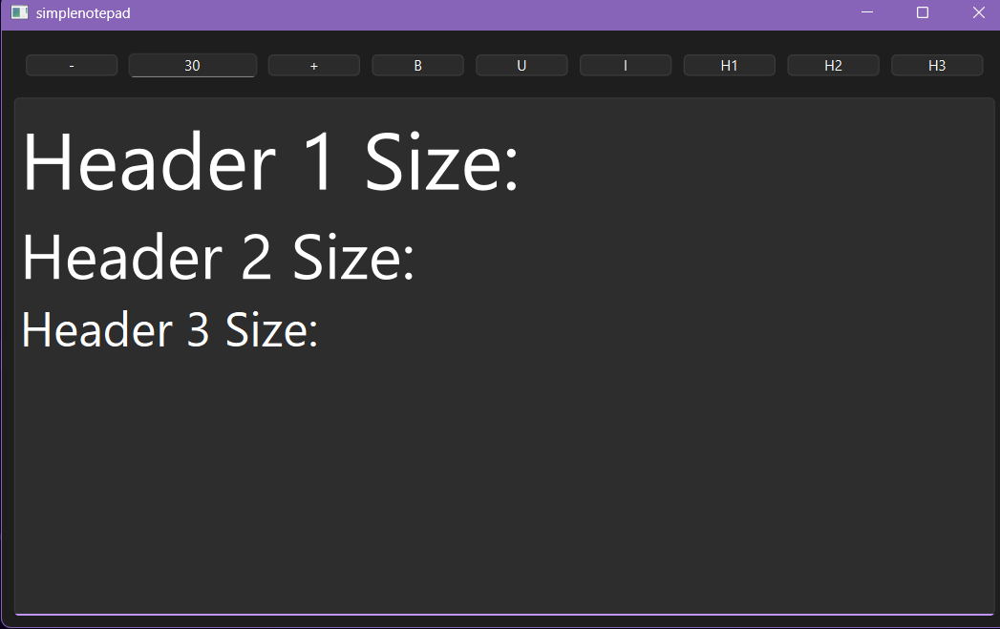

# Simple Qt6 Notepad
* This project is a text-editor window that is designed to help take notes.

# Features

### Text Formatting:
1. Character Bolding 
2. Character Underlining
3. Character Italics
4. Font size customization
5. Resetting Font Size

### Tool Bar
1. Allows the use of aforementioned features as buttons
2. Header Text (Large = H1, Medium = H2, Small = H3)
3. You can set the font size from 1px-99px

# How To Use
1. Character Bolding: Ctrl + B
2. Character Underlining: Ctrl + U
3. Character Italics: Ctrl + I
4. Font **Increment**: Ctrl + "+"
5. Font **Decrement**: Ctrl + "-"
6. Font reset: Alt + "-"

# Screenshots






# Installation Requirements
1. Qt 6.10.2: Gui, Widgets, Core >> https://www.qt.io/development/download-qt-installer-oss
2. Cmake 3.16 or higher
3. Ninja Generator
4. Qt Extension pack if you're using **VSCode**

# Setup (Windows)
1. Make sure to have Qt6's bin folder in your PATH
2. Clone the repo: ```https://github.com/marcdatboi/Qt-Simple-Notepad.git```

